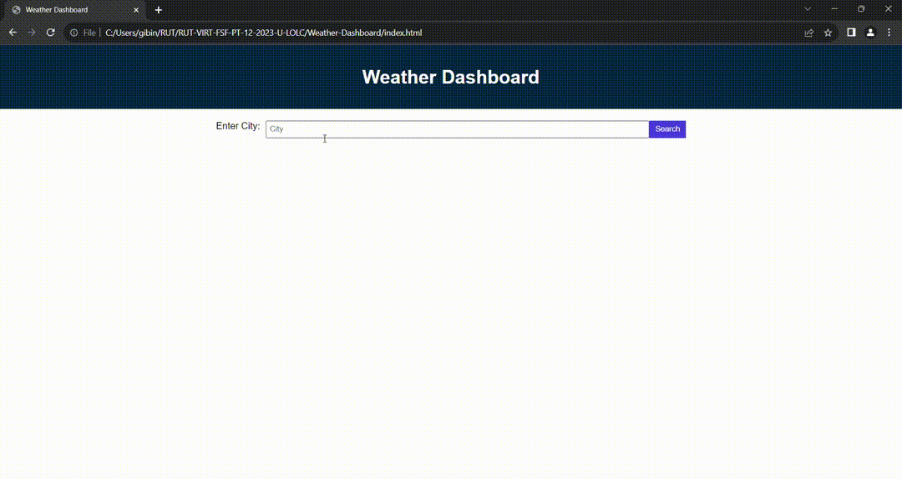

# Weather-Dashboard

This Web Application is a Weather dashboard to know about the current weather as well as the weather forecast of any city.

When the application is opened...

When a city is searched, Then presented with current and future conditions for that city and that city is added to the search history.

When the current weather conditions for that city is viewed, Then it is presented with the city name, the date, an icon representation of weather conditions, the temperature, the humidity, and the the wind speed.

Also able to view future weather conditions for that city and presented with a 5-day forecast that displays the date, an icon representation of weather conditions, the temperature, the wind speed, and the humidity.

When the user clicks on a city in the search history, Then presented with current and future conditions for that city.

JavaScript file is properly commented.

* The URL of the deployed application - https://gibinmgeorge.github.io/Weather-Dashboard/

* The URL of the GitHub repository - https://github.com/GibinMGeorge/Weather-Dashboard

screenshots - 

